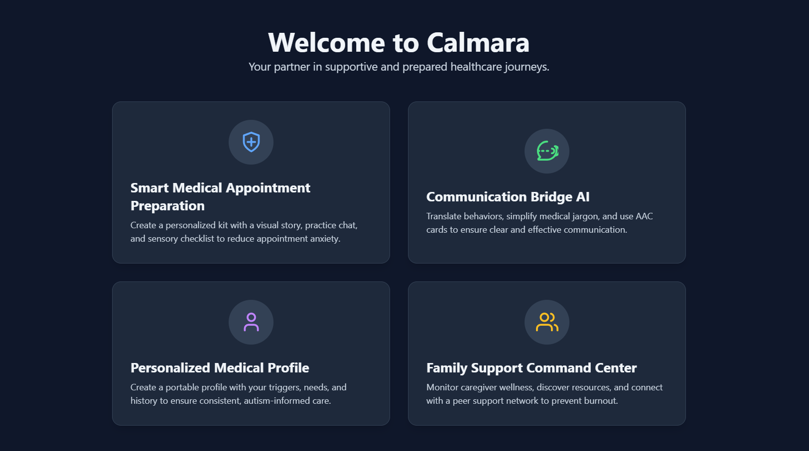
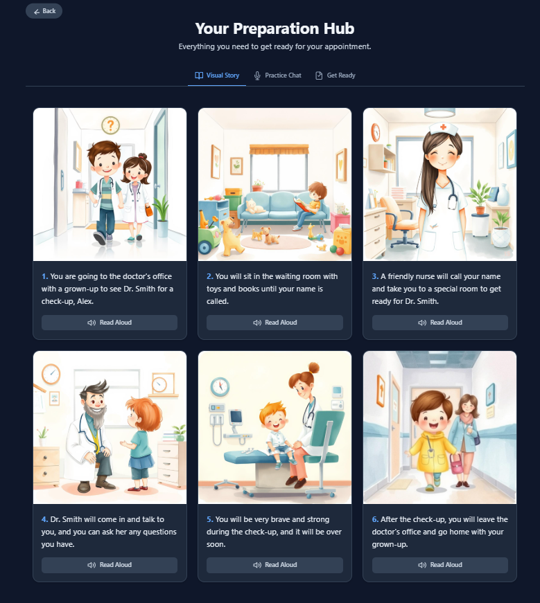
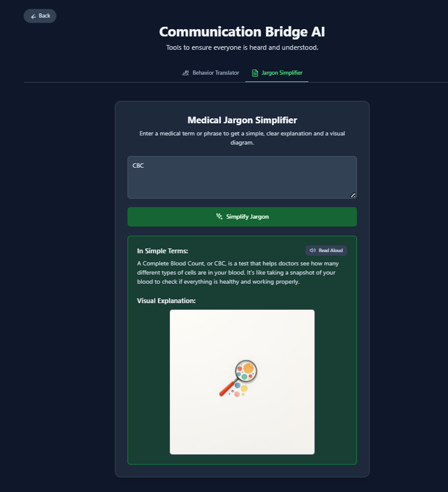

# Calmara

Calmara is a full-stack healthcare preparation platform for autistic individuals
and their caregivers. It helps users prepare for appointments with visual social
stories, sensory preparation, behavior translation, emergency protocols,
provider guides, insurance support, and caregiver resources.



**Home Dashboard**

## Features

- JWT authentication with login and registration
- AI-generated social stories with embedded child-friendly illustrations
- Environmental and sensory preparation checklists
- Clinical behavior translation for provider communication
- Medical jargon and insurance jargon simplification
- Emergency protocols and provider guides
- Sensory log tracking and pattern analysis
- Insurance item tracking and appeal-letter generation
- Peer support and advocacy letter tools
- Downloadable JSON profile export

## Preview



**Appointment Preparation**


**Visual Social Story**



**Jargon Simplifier**

## Tech Stack

Backend:

- Python 3.11
- FastAPI and Uvicorn
- Async SQLAlchemy with aiosqlite for local development
- Alembic migrations
- Pydantic v2 and pydantic-settings
- JWT auth with python-jose
- Password hashing with passlib bcrypt
- Groq API for text generation
- Hugging Face Inference API for image generation
- Pytest and pytest-asyncio

Frontend:

- React 19
- TypeScript
- Vite
- Fetch API client
- LocalStorage JWT session handling

## Project Structure

```text
calmara/
+-- backend/
|   +-- app/
|   +-- alembic/
|   +-- tests/
|   +-- main.py
|   +-- requirements.txt
+-- frontend/
|   +-- components/
|   +-- services/
|   +-- src/
|   +-- App.tsx
|   +-- package.json
+-- README.md
```

## Backend Setup

```powershell
cd backend
python -m pip install -r requirements.txt
copy .env.example .env
alembic upgrade head
uvicorn main:app --reload --port 8000
```

Update `backend/.env` with your own keys:

```text
GROQ_API_KEY=your_groq_key
HF_TOKEN=your_huggingface_token
SECRET_KEY=your_random_secret
DATABASE_URL=sqlite+aiosqlite:///./calmara.db
ACCESS_TOKEN_EXPIRE_DAYS=7
```

Backend docs are available at:

```text
http://localhost:8000/docs
```

## Frontend Setup

```powershell
cd frontend
npm install
copy .env.example .env
npm run dev
```

The frontend expects:

```text
VITE_API_URL=http://localhost:8000
```

## Tests

```powershell
cd backend
pytest tests/
```

## Environment Safety

Real `.env` files, local databases, logs, build output, caches, and
`node_modules` are intentionally ignored by Git. Use the included example env
files to configure local development.